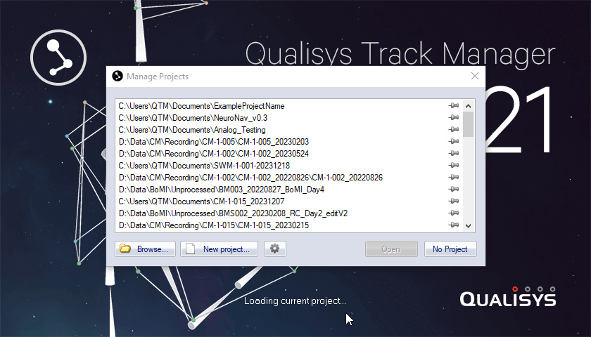

<a id="back-to-top"></a>
# CM Study Workflow Table of Contents
1. [Overview](#overview)
2. [QTM](#qtm)
    1. [Beginning a New Project](#beginning-a-new-project)
        1. [Creating a New Project](#creating-a-new-project)
        2. [Configuring a New Project](#configuring-a-new-project)
            1. [EMG Configuration](#emg-configuration)
            2. [Analog Configuration](#analog-configuration)
            3. [Synchronization](#synchronization)
    4. [Beginning a New Session](#beginning-a-new-session)
        1. [Create a New Session](#create-a-new-session)
        2. [Calibration](#calibration)
        3. [Session Settings](#session-settings)
3. [Theia](#theia)
    1. [First](#)
4. [Visual3D](#visual3d)
    1. [First](#)

# Overview
Three main pieces of software are used to coordinate the recording, annotation, and analysis of movement data associated with cervical myelopathy (CM) studies: 
- <a href="https://www.qualisys.com/software/qualisys-track-manager/">Qualisys Track Manager (QTM)</a>
- <a href="https://www.theiamarkerless.ca/">Theia Markerless</a>
- <a href="https://wiki.has-motion.com/index.php/Visual3D_Overview">Visual3D</a>

QTM calibrates and records the experiment session while Theia tracks and post-processes the captured movement data (joint detection, labeling, etc.). The data is then exported to Visual3D for additional analysis.

Eventually, this repo will contain automation-focused improvements to the flow of data between these three applications. Currently, it just contains instructions adapted from internal instructional guides.  

# QTM
## Beginning a New Project
QTM manages everything by `project`. Projects are essentially workspaces in which QTM will provide default directories and files.  
  
Projects are primarily configured by two files:
- Project Automation Framework (PAF) file with a `.paf` extension.
    - QTM provides preset PAF modules, but the PAF file can also be edited to automate parts of the workflow.
- An additional settings file with a `.qtmproj` extension.
    - Typically, this settings file is imported from a previous project becuase settings in this file don't change very often.  

Should every session be a new project? Every timepoint?  
  
#### [Back to Top](#back-to-top)
---

### Creating a New Project
1.	Open QTM by clicking the following icon  
2.	Click the `New project…` button
3.	Enter a descriptive project name
    -   In most cases, the default project path, `C:\Users\QTM\Documents\<project name>`, will work fine.
4.	Ensure `Settings imported from another project` is selected for the `Base the new project on:` dropdown menu
    -	In general, a new project should always be based on a previous project because much of the configuration remains unchanged (camera orientation, etc.).
5.	Check the `Use PAF module:` checkbox and select `Gait` from the adjacent dropdown menu
    -	Other PAF modules serve different purposes
    -	Reportedly, the `Python` PAF module doesn’t work too well
    -	What are other options and what are they used for?
6.	Click the `OK` button
  

 
7.	After clicking `OK`, you will be prompted to select a `.qtmproj` settings file
    -	For now, it’s recommended to use the file at the location below, though most settings files should work since configuration of the cameras and other such settings don’t change often (if ever):  
    ```C:\Users\QTM\Documents\Settings\Settings.qtmproj```
  
  
  
#### [Back to Top](#back-to-top)
---

### Configuring a New Project
Project configuration is dependent on the nature of all recording components, so these steps will be different if using QTM with analog components and/or Delsys Trigno EMGs.  
  
*If no EMGs or analog components are required, move on to [beginning a new session](#beginning-a-new-session).* No additional configuration will be necessary.

#### EMG Configuration
When using Delsys Trigno EMGs with QTM, the following configuration steps apply:
1. Start Delsys Control Utility by clicking the following icon  
2. Pair sensors and verify connection (green in control utility indicates properly paired sensor)
3. For each connected sensor:
    1. Click the gear icon
    2. Ensure each sensor is in `EMG Only` mode, has a sampling rate of `2148Hz`, and that bandwidth is set to `10-850Hz`
    3. Click the `Apply and Close` button  
   


4. Leaving Delsys Trigno Control Utility open, navigate back to QTM and click the gear icon to open settings 
    1. Click `Input Devices` in the left-hand navigation pane
    2. If `Delsys Trigno` is not in the displayed list:
        1.	Click the `Add Device` button
        2.	Select `Delsys Trigno EMG` from the dropdown menu
        3.	Click the `OK` button and `Delsys Tringo` will appear unchecked in the list of input devices  
  


5. Click the checkbox next to `Delsys Trigno` (under the `Enabled` column)
6. From the left-hand navigation pane, select `Input Devices > EMGs > Delsys Trigno`
7. Ensure all sensors are connected (green `OK` should appear by each port in the `Connection Settings` section)


8. Give a name to every EMG that is connected (sensors are typically named by corresponding muscle)
9. Uncheck the `Auxiliary data` checkbox for each sensor used
    - Auxiliary data is IMU data, but using QTM is often more accurate than IMU data from Delsys sensors, so it's not typically collected
10.	Click the `Apply` button
    - If analog sources are being used and haven't been configured, move on to [analog configuration](#analog-configuration). Otherwise, move on to [synchronization](#synchronization)

  

#### [Back to Top](#back-to-top)
---

#### Analog Configuration
When using analog sources with QTM, the following steps apply:
1. After clicking the gear icon to display settings, click `Input Devices` from the left-hand navigation pane
2. Click the checkbox next to `USB-1608G (Serial: 01D99551)` (under the `Enabled` column)
3. In the left-hand navigation pane, select `Input Devices > Analog Boards > USB-1608G (Serial: 01D99551)`
4. In the `Sample rate` section, click the `Simultaneous start` radio button
5. Change `Sample rate`/`samples per second` to some favorable value 
    - What should this value be?  
    


7. In the `Channels` section, enable whichever analog channels are used by clicking the corresponding checkbox in the `Channel no` column
    - These analog channels are not related to EMGs, so they may be different from EMGs in quantity and channel number

8. Click the `Apply` button
    - If EMGs are being used and haven't been configured, move on to [EMG configuration](#emg-configuration). Otherwise, move on to [synchronization](#synchronization)  
  
  

#### [Back to Top](#back-to-top)
---

### Synchronization
When using QTM with EMGs or analog sources, synchronization settings must be changed to ensure proper recording alignment.

1. Click the gear icon to show the settings menu
2. In the left-hand navigation pane, select `Input Devices > Camera System > Synchronization`
3. In the `Wireless/software Trigger*` section, change the `Function` dropdown to `Start capture`
4. In the `Trigger port(s)*` section, change the `Trig NO: Function` dropdown to `Start capture`
5. Click the `Apply` button
6. Click the `OK` button to finish configuration

  

#### [Back to Top](#back-to-top)
---

## Beginning a New Session
After [configuration](#configuring-a-new-project) is complete, a new recording session can be started by following the steps in this section

### Create a New Session
1. In Project data tree, click `Add > Patient`
    1. Enter patient ID
        - This will be the subject ID as determined by the study
    2. Enter “first” as first name (do not use name of participant)
    3. Enter “last” as last name (do not use name of participant)
    4. Click the `OK` button  
  


2. In the `Project data tree` section, ensure the subject ID folder is selected, then click `Add > Gait Session`
    1. Enter height and weight of participant
    2. Click the `OK` button.
        - A new directory will be added inside the subject ID directory displayed in the `Project data tree` section  
  


3. Click on the newly created directory in the `Project data tree` section, then click `Add > Markerless session`
    1. Change `Event Mode` to `No forceplate (automatic)`
    2. Click the `OK` button  
  


The session is now ready for [calibration](#calibration)  

#### [Back to Top](#back-to-top)
---

### Calibration
1. After adding a [new markerless session](#create-a-new-session), click on one of the colored boxes and select `Start preview`
2. If recording markerless video, click the `Video` button in the right-hand pane
    1. In the `Streaming Video` section that appears, ensure `85 Hz` is selected  
  


3. Click on the calibrate icon
    1. Increase the calibration time if calibrating a larger area (~60 seconds)
        - If only one person is performing the calibration, a calibration delay of ~10 seconds may be helpful to allow time to get in place
        - Sound notification is helpful for knowing when calibration is finished
    2. Click `OK` and perform calibration  
  
  

#### [Back to Top](#back-to-top)
---

### Session Settings
After [calibration](#calibration) but before recording, the session settings will need to be modified. This only needs to happen once per session.
1. Click on any colored box and select `Edit settings and capture`
    1. Change `Capture Period` to well over expected amount of time for the trial
    2. Click the `Start` button to begin capture  
  
  

#### [Back to Top](#back-to-top)
---
## Theia
### First
#### [Back to Top](#back-to-top)
---
## Visual3D
### First
#### [Back to Top](#back-to-top)
---
